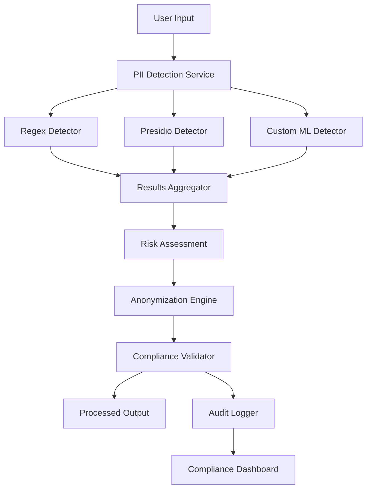

# 🧪 Lab 4: Sistema de Detección de PII y Compliance

## 🎯 Objetivos del Laboratorio

Al completar este laboratorio podrás:
- Implementar detectores de PII con Microsoft Presidio
- Crear pipelines de anonimización automática
- Configurar compliance con GDPR y otras regulaciones
- Monitorear y auditar el procesamiento de datos personales
- Integrar detección de PII en aplicaciones LLM

## 📋 Prerrequisitos

- Docker y Docker Compose instalados
- Python 3.9+
- Conocimientos básicos de GDPR/Privacy regulations

## 🏗️ Arquitectura del Sistema



## 🚀 Configuración del Entorno

### 1. Estructura del Proyecto

```bash
pii-detection-lab/
├── docker-compose.yml
├── requirements.txt
├── src/
│   ├── detectors/
│   │   ├── __init__.py
│   │   ├── regex_detector.py
│   │   ├── presidio_detector.py
│   │   └── ml_detector.py
│   ├── compliance/
│   │   ├── __init__.py
│   │   ├── gdpr_manager.py
│   │   └── anonymizer.py
│   ├── api/
│   │   ├── __init__.py
│   │   └── main.py
│   └── monitoring/
│       ├── __init__.py
│       └── metrics.py
├── tests/
│   ├── test_detectors.py
│   ├── test_compliance.py
│   └── test_data/
│       ├── sample_texts.py
│       └── test_cases.json
├── dashboards/
│   └── compliance_dashboard.json
└── config/
    ├── presidio_config.yaml
    └── compliance_rules.yaml
```

### 2. Docker Compose Setup

```yaml
version: '3.8'

services:
  pii-detection-api:
    build: .
    ports:
      - "8000:8000"
    environment:
      - PYTHONPATH=/app
      - LOG_LEVEL=INFO
    volumes:
      - ./src:/app/src
      - ./config:/app/config
      - ./data:/app/data
    depends_on:
      - redis
      - postgres
      - prometheus

  redis:
    image: redis:7-alpine
    ports:
      - "6379:6379"
    volumes:
      - redis_data:/data

  postgres:
    image: postgres:15
    environment:
      POSTGRES_DB: compliance_db
      POSTGRES_USER: admin
      POSTGRES_PASSWORD: secret_password
    ports:
      - "5432:5432"
    volumes:
      - postgres_data:/var/lib/postgresql/data
      - ./sql:/docker-entrypoint-initdb.d

  prometheus:
    image: prom/prometheus:latest
    ports:
      - "9090:9090"
    volumes:
      - ./monitoring/prometheus.yml:/etc/prometheus/prometheus.yml
      - prometheus_data:/prometheus

  grafana:
    image: grafana/grafana:latest
    ports:
      - "3000:3000"
    environment:
      - GF_SECURITY_ADMIN_PASSWORD=admin
    volumes:
      - grafana_data:/var/lib/grafana
      - ./dashboards:/etc/grafana/provisioning/dashboards

volumes:
  redis_data:
  postgres_data:
  prometheus_data:
  grafana_data:
```

### 3. Dockerfile

```dockerfile
FROM python:3.11-slim

WORKDIR /app

# Instalar dependencias del sistema
RUN apt-get update && apt-get install -y \
    gcc \
    g++ \
    curl \
    && rm -rf /var/lib/apt/lists/*

# Instalar spaCy models
RUN python -m pip install --upgrade pip
COPY requirements.txt .
RUN pip install -r requirements.txt

# Descargar modelos de spaCy
RUN python -m spacy download en_core_web_sm
RUN python -m spacy download es_core_news_sm

COPY . .

EXPOSE 8000

CMD ["uvicorn", "src.api.main:app", "--host", "0.0.0.0", "--port", "8000", "--reload"]
```

### 4. Requirements.txt

```txt
# Core framework
fastapi==0.104.1
uvicorn[standard]==0.24.0
pydantic==2.5.0

# PII Detection
presidio-analyzer==2.2.352
presidio-anonymizer==2.2.352
spacy==3.7.2
transformers==4.35.2
torch==2.1.1

# NLP Libraries
nltk==3.8.1
regex==2023.10.3

# Database
sqlalchemy==2.0.23
asyncpg==0.29.0
alembic==1.13.0

# Cache & Queue
redis==5.0.1
celery==5.3.4

# Monitoring
prometheus-client==0.19.0
structlog==23.2.0

# Security
cryptography==41.0.8
python-jose[cryptography]==3.3.0

# Testing
pytest==7.4.3
pytest-asyncio==0.21.1
httpx==0.25.2

# Utilities
python-multipart==0.0.6
python-dotenv==1.0.0
```

## 💻 Implementación

### 1. Detector Avanzado con Presidio

```python
# src/detectors/presidio_detector.py
import asyncio
import logging
from typing import Dict, List, Any, Optional
from presidio_analyzer import AnalyzerEngine, RecognizerRegistry
from presidio_anonymizer import AnonymizerEngine
from presidio_analyzer.nlp_engine import NlpEngineProvider
import spacy

logger = logging.getLogger(__name__)

class AdvancedPresidioDetector:
    """Detector avanzado de PII usando Microsoft Presidio"""
    
    def __init__(self, languages: List[str] = ["en", "es"]):
        self.languages = languages
        self._initialize_engines()
        self._setup_custom_recognizers()
    
    def _initialize_engines(self):
        """Inicializar motores de análisis y anonimización"""
        
        # Configuración de modelos NLP
        nlp_config = {
            "nlp_engine_name": "spacy",
            "models": [
                {"lang_code": "en", "model_name": "en_core_web_sm"},
                {"lang_code": "es", "model_name": "es_core_news_sm"}
            ]
        }
        
        try:
            # Crear proveedor NLP
            provider = NlpEngineProvider(nlp_configuration=nlp_config)
            nlp_engine = provider.create_engine()
            
            # Inicializar engines
            self.analyzer = AnalyzerEngine(nlp_engine=nlp_engine)
            self.anonymizer = AnonymizerEngine()
            
            logger.info("Presidio engines initialized successfully")
            
        except Exception as e:
            logger.error(f"Error initializing Presidio engines: {e}")
            raise
    
    def _setup_custom_recognizers(self):
        """Configurar reconocedores personalizados"""
        
        # Reconocedor para DNI español
        dni_pattern = r'\b\d{8}[A-Za-z]\b'
        dni_recognizer = self._create_pattern_recognizer(
            "ES_DNI", 
            [dni_pattern], 
            ["DNI", "Documento Nacional de Identidad"]
        )
        
        # Reconocedor para números de cuenta bancaria
        iban_pattern = r'\b[A-Z]{2}\d{2}\s?[A-Z0-9]{4}\s?\d{4}\s?\d{4}\s?\d{4}\s?\d{4}\b'
        iban_recognizer = self._create_pattern_recognizer(
            "IBAN_EXTENDED",
            [iban_pattern],
            ["IBAN", "cuenta bancaria", "bank account"]
        )
        
        # Añadir reconocedores al registry
        self.analyzer.registry.add_recognizer(dni_recognizer)
        self.analyzer.registry.add_recognizer(iban_recognizer)
    
    def _create_pattern_recognizer(self, name: str, patterns: List[str], context: List[str]):
        """Crear reconocedor basado en patrones"""
        from presidio_analyzer import PatternRecognizer, Pattern
        
        compiled_patterns = [
            Pattern(name=f"{name}_pattern_{i}", regex=pattern, score=0.8)
            for i, pattern in enumerate(patterns)
        ]
        
        return PatternRecognizer(
            supported_entity=name,
            patterns=compiled_patterns,
            context=context
        )
    
    async def analyze_text(self, 
                          text: str, 
                          language: str = "en",
                          entities: Optional[List[str]] = None,
                          score_threshold: float = 0.6) -> Dict[str, Any]:
        """Analizar texto para detectar PII"""
        
        try:
            # Entidades por defecto
            default_entities = [
                "PERSON", "EMAIL_ADDRESS", "PHONE_NUMBER", "CREDIT_CARD",
                "CRYPTO", "DATE_TIME", "IBAN_CODE", "IP_ADDRESS", 
                "LOCATION", "MEDICAL_LICENSE", "SSN", "UK_NHS",
                "US_BANK_NUMBER", "US_DRIVER_LICENSE", "US_ITIN",
                "US_PASSPORT", "URL", "BITCOIN_ADDRESS", "ES_DNI"
            ]
            
            entities_to_analyze = entities or default_entities
            
            # Análisis con Presidio
            results = self.analyzer.analyze(
                text=text,
                entities=entities_to_analyze,
                language=language,
                score_threshold=score_threshold
            )
            
            # Procesar resultados
            detected_entities = []
            for result in results:
                entity_data = {
                    'entity_type': result.entity_type,
                    'start': result.start,
                    'end': result.end,
                    'score': result.score,
                    'text': text[result.start:result.end],
                    'recognition_metadata': result.recognition_metadata
                }
                detected_entities.append(entity_data)
            
            # Análisis de riesgo
            risk_assessment = self._assess_risk(detected_entities)
            
            return {
                'text_analyzed': True,
                'language': language,
                'entities_detected': len(detected_entities),
                'entities': detected_entities,
                'risk_assessment': risk_assessment,
                'analysis_metadata': {
                    'score_threshold': score_threshold,
                    'entities_searched': entities_to_analyze,
                    'analyzer_version': self.analyzer.__class__.__module__
                }
            }
            
        except Exception as e:
            logger.error(f"Error analyzing text: {e}")
            return {
                'text_analyzed': False,
                'error': str(e),
                'entities': []
            }
    
    def _assess_risk(self, entities: List[Dict[str, Any]]) -> Dict[str, Any]:
        """Evaluar riesgo basado en entidades detectadas"""
        
        if not entities:
            return {'level': 'NONE', 'score': 0.0, 'factors': []}
        
        # Pesos de riesgo por tipo de entidad
        risk_weights = {
            'CREDIT_CARD': 1.0,
            'SSN': 1.0,
            'US_PASSPORT': 0.9,
            'IBAN_CODE': 0.9,
            'ES_DNI': 0.9,
            'MEDICAL_LICENSE': 0.8,
            'EMAIL_ADDRESS': 0.6,
            'PHONE_NUMBER': 0.6,
            'PERSON': 0.5,
            'LOCATION': 0.4,
            'IP_ADDRESS': 0.3,
            'DATE_TIME': 0.2
        }
        
        total_risk = 0.0
        entity_counts = {}
        risk_factors = []
        
        for entity in entities:
            entity_type = entity['entity_type']
            score = entity['score']
            
            # Contar entidades por tipo
            entity_counts[entity_type] = entity_counts.get(entity_type, 0) + 1
            
            # Calcular riesgo
            base_weight = risk_weights.get(entity_type, 0.3)
            entity_risk = base_weight * score
            total_risk += entity_risk
            
            risk_factors.append({
                'entity_type': entity_type,
                'risk_score': entity_risk,
                'confidence': score
            })
        
        # Factor de múltiples tipos
        if len(entity_counts) > 2:
            total_risk *= 1.3
            risk_factors.append({
                'factor': 'multiple_pii_types',
                'multiplier': 1.3
            })
        
        # Factor de alta densidad
        if len(entities) > 5:
            total_risk *= 1.2
            risk_factors.append({
                'factor': 'high_density',
                'multiplier': 1.2
            })
        
        # Determinar nivel
        if total_risk >= 2.0:
            level = 'CRITICAL'
        elif total_risk >= 1.0:
            level = 'HIGH'
        elif total_risk >= 0.5:
            level = 'MEDIUM'
        else:
            level = 'LOW'
        
        return {
            'level': level,
            'score': round(min(total_risk, 3.0), 2),
            'entity_counts': entity_counts,
            'factors': risk_factors
        }
    
    async def anonymize_text(self, 
                           text: str, 
                           language: str = "en",
                           anonymization_config: Optional[Dict[str, Dict]] = None) -> Dict[str, Any]:
        """Anonimizar texto detectando y reemplazando PII"""
        
        try:
            # Analizar primero
            analysis = await self.analyze_text(text, language)
            
            if not analysis['text_analyzed'] or not analysis['entities']:
                return {
                    'anonymized': False,
                    'original_text': text,
                    'anonymized_text': text,
                    'reason': 'No PII detected or analysis failed'
                }
            
            # Configuración de anonimización por defecto
            default_config = {
                'CREDIT_CARD': {'type': 'redact'},
                'SSN': {'type': 'redact'},
                'US_PASSPORT': {'type': 'redact'},
                'IBAN_CODE': {'type': 'mask', 'masking_char': '*', 'chars_to_mask': 8},
                'ES_DNI': {'type': 'mask', 'masking_char': '*', 'chars_to_mask': 5},
                'EMAIL_ADDRESS': {'type': 'replace', 'new_value': '<EMAIL>'},
                'PHONE_NUMBER': {'type': 'replace', 'new_value': '<PHONE>'},
                'PERSON': {'type': 'replace', 'new_value': '<PERSON>'},
                'LOCATION': {'type': 'replace', 'new_value': '<LOCATION>'},
                'IP_ADDRESS': {'type': 'replace', 'new_value': '<IP>'}
            }
            
            # Usar configuración personalizada si se proporciona
            config = anonymization_config or default_config
            
            # Preparar resultados de análisis para anonimización
            from presidio_analyzer import RecognizerResult
            analyzer_results = []
            
            for entity in analysis['entities']:
                result = RecognizerResult(
                    entity_type=entity['entity_type'],
                    start=entity['start'],
                    end=entity['end'],
                    score=entity['score']
                )
                analyzer_results.append(result)
            
            # Realizar anonimización
            anonymized_result = self.anonymizer.anonymize(
                text=text,
                analyzer_results=analyzer_results,
                operators=config
            )
            
            # Verificar anonimización
            verification = await self._verify_anonymization(anonymized_result.text, language)
            
            return {
                'anonymized': True,
                'original_text': text,
                'anonymized_text': anonymized_result.text,
                'entities_anonymized': len(analyzer_results),
                'anonymization_items': [
                    {
                        'entity_type': item.entity_type,
                        'start': item.start,
                        'end': item.end,
                        'operator': item.operator,
                        'text': item.text
                    }
                    for item in anonymized_result.items
                ],
                'verification': verification,
                'risk_reduction': self._calculate_risk_reduction(analysis, verification)
            }
            
        except Exception as e:
            logger.error(f"Error anonymizing text: {e}")
            return {
                'anonymized': False,
                'error': str(e),
                'original_text': text
            }
    
    async def _verify_anonymization(self, anonymized_text: str, language: str) -> Dict[str, Any]:
        """Verificar que la anonimización fue efectiva"""
        
        # Re-analizar texto anonimizado
        verification_analysis = await self.analyze_text(anonymized_text, language)
        
        return {
            'verification_passed': not verification_analysis.get('entities', []),
            'remaining_entities': len(verification_analysis.get('entities', [])),
            'remaining_risk_level': verification_analysis.get('risk_assessment', {}).get('level', 'NONE'),
            'details': verification_analysis.get('entities', [])
        }
    
    def _calculate_risk_reduction(self, original_analysis: Dict, verification: Dict) -> Dict[str, Any]:
        """Calcular reducción de riesgo después de anonimización"""
        
        original_risk = original_analysis.get('risk_assessment', {}).get('score', 0)
        remaining_risk = 0
        
        if not verification.get('verification_passed', True):
            # Si quedan entidades, estimar riesgo residual
            remaining_entities = verification.get('remaining_entities', 0)
            remaining_risk = min(remaining_entities * 0.1, original_risk * 0.3)
        
        risk_reduction = original_risk - remaining_risk
        reduction_percentage = (risk_reduction / original_risk * 100) if original_risk > 0 else 100
        
        return {
            'original_risk_score': original_risk,
            'remaining_risk_score': remaining_risk,
            'risk_reduction': risk_reduction,
            'reduction_percentage': round(reduction_percentage, 1)
        }
```

### 2. Gestor de Compliance GDPR

```python
# src/compliance/gdpr_manager.py
import asyncio
import logging
from datetime import datetime, timedelta
from typing import Dict, List, Optional, Any
from enum import Enum
from dataclasses import dataclass, asdict
import json
import hashlib
from sqlalchemy.ext.asyncio import AsyncSession
from sqlalchemy import select, update, delete
import redis.asyncio as redis

logger = logging.getLogger(__name__)

class ConsentType(Enum):
    EXPLICIT = "explicit"
    IMPLIED = "implied"
    LEGITIMATE_INTEREST = "legitimate_interest"

class DataPurpose(Enum):
    AI_TRAINING = "ai_training"
    SERVICE_IMPROVEMENT = "service_improvement"
    ANALYTICS = "analytics"
    MARKETING = "marketing"
    ESSENTIAL_SERVICES = "essential_services"

class ProcessingBasis(Enum):
    CONSENT = "consent"
    CONTRACT = "contract"
    LEGAL_OBLIGATION = "legal_obligation"
    VITAL_INTERESTS = "vital_interests"
    PUBLIC_TASK = "public_task"
    LEGITIMATE_INTERESTS = "legitimate_interests"

@dataclass
class ConsentRecord:
    user_id: str
    purposes: List[DataPurpose]
    consent_type: ConsentType
    processing_basis: ProcessingBasis
    timestamp: datetime
    ip_address: str
    user_agent: str
    consent_string: str
    expiry_date: Optional[datetime] = None
    withdrawn: bool = False
    withdrawal_date: Optional[datetime] = None

@dataclass
class ProcessingActivity:
    activity_id: str
    user_id: str
    purpose: DataPurpose
    data_types: List[str]
    processing_basis: ProcessingBasis
    timestamp: datetime
    retention_period: timedelta
    consent_required: bool = True

class AdvancedGDPRManager:
    """Gestor avanzado de compliance con GDPR"""
    
    def __init__(self, db_session: AsyncSession, redis_client: redis.Redis):
        self.db = db_session
        self.redis = redis_client
        
        # Configuración de retención por propósito
        self.retention_policies = {
            DataPurpose.AI_TRAINING: timedelta(days=1095),  # 3 años
            DataPurpose.SERVICE_IMPROVEMENT: timedelta(days=730),  # 2 años
            DataPurpose.ANALYTICS: timedelta(days=365),  # 1 año
            DataPurpose.MARKETING: timedelta(days=1095),  # 3 años
            DataPurpose.ESSENTIAL_SERVICES: timedelta(days=2555)  # 7 años
        }
        
        # Configuración de base legal por propósito
        self.legal_basis_mapping = {
            DataPurpose.AI_TRAINING: ProcessingBasis.CONSENT,
            DataPurpose.SERVICE_IMPROVEMENT: ProcessingBasis.LEGITIMATE_INTERESTS,
            DataPurpose.ANALYTICS: ProcessingBasis.CONSENT,
            DataPurpose.MARKETING: ProcessingBasis.CONSENT,
            DataPurpose.ESSENTIAL_SERVICES: ProcessingBasis.CONTRACT
        }
    
    async def record_consent(self, 
                           user_id: str,
                           purposes: List[DataPurpose],
                           consent_type: ConsentType = ConsentType.EXPLICIT,
                           ip_address: str = "",
                           user_agent: str = "",
                           consent_string: str = "") -> Dict[str, Any]:
        """Registrar consentimiento del usuario"""
        
        try:
            # Validar entrada
            if not user_id or not purposes:
                return {
                    'success': False,
                    'error': 'User ID and purposes are required'
                }
            
            # Determinar base de procesamiento
            processing_basis = self.legal_basis_mapping.get(
                purposes[0], ProcessingBasis.CONSENT
            )
            
            # Calcular fecha de expiración
            expiry_date = None
            if consent_type == ConsentType.EXPLICIT:
                expiry_date = datetime.now() + timedelta(days=730)  # 2 años
            
            # Crear registro de consentimiento
            consent_record = ConsentRecord(
                user_id=user_id,
                purposes=purposes,
                consent_type=consent_type,
                processing_basis=processing_basis,
                timestamp=datetime.now(),
                ip_address=ip_address,
                user_agent=user_agent,
                consent_string=consent_string,
                expiry_date=expiry_date
            )
            
            # Guardar en cache para acceso rápido
            cache_key = f"consent:{user_id}"
            await self.redis.setex(
                cache_key, 
                3600,  # 1 hora TTL
                json.dumps(asdict(consent_record), default=str)
            )
            
            # Log de auditoría
            await self._log_audit_event(
                user_id=user_id,
                event_type="consent_recorded",
                details={
                    'purposes': [p.value for p in purposes],
                    'consent_type': consent_type.value,
                    'ip_address': ip_address
                }
            )
            
            logger.info(f"Consent recorded for user {user_id}")
            
            return {
                'success': True,
                'consent_id': hashlib.md5(f"{user_id}_{datetime.now()}".encode()).hexdigest(),
                'expiry_date': expiry_date,
                'purposes_granted': [p.value for p in purposes]
            }
            
        except Exception as e:
            logger.error(f"Error recording consent: {e}")
            return {
                'success': False,
                'error': str(e)
            }
    
    async def check_consent(self, 
                          user_id: str, 
                          purpose: DataPurpose) -> Dict[str, Any]:
        """Verificar consentimiento válido para propósito específico"""
        
        try:
            # Intentar desde cache primero
            cache_key = f"consent:{user_id}"
            cached_consent = await self.redis.get(cache_key)
            
            consent_record = None
            if cached_consent:
                consent_data = json.loads(cached_consent)
                # Reconstruir objeto ConsentRecord
                consent_record = ConsentRecord(**consent_data)
            
            if not consent_record:
                return {
                    'has_consent': False,
                    'reason': 'No consent record found',
                    'legal_basis': None
                }
            
            # Verificar si fue retirado
            if consent_record.withdrawn:
                return {
                    'has_consent': False,
                    'reason': 'Consent withdrawn',
                    'withdrawal_date': consent_record.withdrawal_date,
                    'legal_basis': None
                }
            
            # Verificar expiración
            if (consent_record.expiry_date and 
                datetime.now() > consent_record.expiry_date):
                return {
                    'has_consent': False,
                    'reason': 'Consent expired',
                    'expired_on': consent_record.expiry_date,
                    'legal_basis': None
                }
            
            # Verificar propósito específico
            if purpose not in consent_record.purposes:
                # Verificar si se puede procesar bajo otra base legal
                alternative_basis = self.legal_basis_mapping.get(purpose)
                
                if (alternative_basis in [ProcessingBasis.LEGITIMATE_INTERESTS, 
                                        ProcessingBasis.CONTRACT]):
                    return {
                        'has_consent': True,
                        'legal_basis': alternative_basis.value,
                        'basis_note': f'Processing under {alternative_basis.value}',
                        'consent_type': consent_record.consent_type.value,
                        'granted_on': consent_record.timestamp
                    }
                else:
                    return {
                        'has_consent': False,
                        'reason': f'No consent for purpose: {purpose.value}',
                        'legal_basis': None
                    }
            
            return {
                'has_consent': True,
                'legal_basis': consent_record.processing_basis.value,
                'consent_type': consent_record.consent_type.value,
                'granted_on': consent_record.timestamp,
                'expires_on': consent_record.expiry_date,
                'purposes': [p.value for p in consent_record.purposes]
            }
            
        except Exception as e:
            logger.error(f"Error checking consent: {e}")
            return {
                'has_consent': False,
                'error': str(e),
                'legal_basis': None
            }
    
    async def withdraw_consent(self, 
                             user_id: str, 
                             specific_purposes: Optional[List[DataPurpose]] = None) -> Dict[str, Any]:
        """Retirar consentimiento (Right to Withdraw)"""
        
        try:
            # Obtener registro actual
            cache_key = f"consent:{user_id}"
            cached_consent = await self.redis.get(cache_key)
            
            if not cached_consent:
                return {
                    'success': False,
                    'error': 'No consent record found'
                }
            
            consent_data = json.loads(cached_consent)
            
            if specific_purposes:
                # Retirar consentimiento solo para propósitos específicos
                remaining_purposes = [
                    p for p in consent_data['purposes'] 
                    if DataPurpose(p) not in specific_purposes
                ]
                
                if remaining_purposes:
                    # Actualizar registro con propósitos restantes
                    consent_data['purposes'] = remaining_purposes
                    await self.redis.setex(cache_key, 3600, json.dumps(consent_data, default=str))
                else:
                    # No quedan propósitos, marcar como retirado completamente
                    consent_data['withdrawn'] = True
                    consent_data['withdrawal_date'] = datetime.now().isoformat()
                    await self.redis.setex(cache_key, 3600, json.dumps(consent_data, default=str))
            else:
                # Retirar todo el consentimiento
                consent_data['withdrawn'] = True
                consent_data['withdrawal_date'] = datetime.now().isoformat()
                await self.redis.setex(cache_key, 3600, json.dumps(consent_data, default=str))
            
            # Log de auditoría
            await self._log_audit_event(
                user_id=user_id,
                event_type="consent_withdrawn",
                details={
                    'specific_purposes': [p.value for p in (specific_purposes or [])],
                    'full_withdrawal': specific_purposes is None
                }
            )
            
            logger.info(f"Consent withdrawn for user {user_id}")
            
            return {
                'success': True,
                'withdrawal_date': datetime.now(),
                'purposes_withdrawn': [p.value for p in (specific_purposes or consent_data['purposes'])]
            }
            
        except Exception as e:
            logger.error(f"Error withdrawing consent: {e}")
            return {
                'success': False,
                'error': str(e)
            }
    
    async def delete_user_data(self, user_id: str) -> Dict[str, Any]:
        """Implementar Right to Erasure (GDPR Art. 17)"""
        
        try:
            deletion_log = {
                'user_id': user_id,
                'deletion_timestamp': datetime.now(),
                'deleted_from': [],
                'errors': [],
                'retention_exceptions': []
            }
            
            # 1. Eliminar registros de consentimiento
            cache_key = f"consent:{user_id}"
            deleted_from_cache = await self.redis.delete(cache_key)
            if deleted_from_cache:
                deletion_log['deleted_from'].append('consent_cache')
            
            # 2. Verificar excepciones de retención
            exceptions = await self._check_retention_exceptions(user_id)
            deletion_log['retention_exceptions'] = exceptions
            
            # 3. Eliminar datos procesados (en implementación real)
            # - Registros de conversaciones
            # - Embeddings personalizados
            # - Logs de interacción
            # - Modelos fine-tuneados
            
            # 4. Crear certificado de eliminación
            deletion_certificate = await self._create_deletion_certificate(user_id, deletion_log)
            
            # 5. Log de auditoría
            await self._log_audit_event(
                user_id=user_id,
                event_type="data_deletion_completed",
                details=deletion_log
            )
            
            logger.info(f"Data deletion completed for user {user_id}")
            
            return {
                'success': True,
                'deletion_certificate': deletion_certificate,
                'deletion_log': deletion_log
            }
            
        except Exception as e:
            logger.error(f"Error deleting user data: {e}")
            return {
                'success': False,
                'error': str(e)
            }
    
    async def export_user_data(self, user_id: str) -> Dict[str, Any]:
        """Implementar Right to Data Portability (GDPR Art. 20)"""
        
        try:
            export_data = {
                'user_id': user_id,
                'export_timestamp': datetime.now(),
                'data_controller': 'Your Organization Name',
                'export_format': 'JSON',
                'data_sources': {}
            }
            
            # 1. Exportar registros de consentimiento
            cache_key = f"consent:{user_id}"
            consent_data = await self.redis.get(cache_key)
            if consent_data:
                export_data['data_sources']['consent_records'] = json.loads(consent_data)
            
            # 2. Exportar actividades de procesamiento
            processing_activities = await self._get_user_processing_activities(user_id)
            export_data['data_sources']['processing_activities'] = processing_activities
            
            # 3. En implementación real, exportar:
            # - Historial de conversaciones
            # - Preferencias de usuario
            # - Datos de entrenamiento contribuidos
            # - Métricas de uso (anonimizadas)
            
            # 4. Crear archivo de exportación
            export_id = hashlib.md5(f"{user_id}_{datetime.now()}".encode()).hexdigest()
            
            # 5. Log de auditoría
            await self._log_audit_event(
                user_id=user_id,
                event_type="data_export_completed",
                details={'export_id': export_id, 'data_sources': list(export_data['data_sources'].keys())}
            )
            
            logger.info(f"Data export completed for user {user_id}")
            
            return {
                'success': True,
                'export_id': export_id,
                'export_data': export_data,
                'download_expires': datetime.now() + timedelta(days=30)
            }
            
        except Exception as e:
            logger.error(f"Error exporting user data: {e}")
            return {
                'success': False,
                'error': str(e)
            }
    
    async def check_data_retention(self) -> List[Dict[str, Any]]:
        """Verificar políticas de retención de datos"""
        
        try:
            expired_data = []
            
            # En implementación real, consultar base de datos
            # por registros que excedan políticas de retención
            
            # Ejemplo de lógica:
            # for activity in processing_activities:
            #     retention_period = self.retention_policies.get(activity.purpose)
            #     if retention_period and activity.timestamp + retention_period < datetime.now():
            #         expired_data.append({...})
            
            return expired_data
            
        except Exception as e:
            logger.error(f"Error checking data retention: {e}")
            return []
    
    async def _log_audit_event(self, 
                             user_id: str, 
                             event_type: str, 
                             details: Dict[str, Any]):
        """Registrar evento de auditoría"""
        
        audit_event = {
            'timestamp': datetime.now().isoformat(),
            'user_id': user_id,
            'event_type': event_type,
            'details': details,
            'system': 'gdpr_manager'
        }
        
        # Guardar en Redis con TTL de 7 años (requerimiento legal)
        audit_key = f"audit:{user_id}:{datetime.now().timestamp()}"
        await self.redis.setex(audit_key, 220752000, json.dumps(audit_event))  # 7 años
    
    async def _check_retention_exceptions(self, user_id: str) -> List[Dict[str, Any]]:
        """Verificar excepciones legales para retención de datos"""
        
        exceptions = []
        
        # Ejemplo: obligaciones legales, disputas legales, etc.
        # En implementación real, consultar sistemas de CRM, legal, etc.
        
        return exceptions
    
    async def _create_deletion_certificate(self, user_id: str, deletion_log: Dict) -> str:
        """Crear certificado de eliminación de datos"""
        
        certificate = {
            'certificate_id': hashlib.md5(f"cert_{user_id}_{datetime.now()}".encode()).hexdigest(),
            'user_id': user_id,
            'deletion_completed': datetime.now().isoformat(),
            'data_controller': 'Your Organization Name',
            'deletion_scope': deletion_log['deleted_from'],
            'retention_exceptions': deletion_log['retention_exceptions'],
            'legal_basis': 'GDPR Article 17 - Right to Erasure'
        }
        
        return json.dumps(certificate, indent=2)
    
    async def _get_user_processing_activities(self, user_id: str) -> List[Dict[str, Any]]:
        """Obtener actividades de procesamiento del usuario"""
        
        # En implementación real, consultar base de datos
        return []
```

### 3. API Principal

```python
# src/api/main.py
from fastapi import FastAPI, HTTPException, Depends, BackgroundTasks
from fastapi.middleware.cors import CORSMiddleware
from pydantic import BaseModel
from typing import List, Optional, Dict, Any
import logging
from datetime import datetime

from ..detectors.presidio_detector import AdvancedPresidioDetector
from ..compliance.gdpr_manager import AdvancedGDPRManager, DataPurpose, ConsentType

# Configurar logging
logging.basicConfig(level=logging.INFO)
logger = logging.getLogger(__name__)

app = FastAPI(
    title="PII Detection & GDPR Compliance API",
    description="Advanced PII detection and GDPR compliance management system",
    version="1.0.0"
)

# CORS
app.add_middleware(
    CORSMiddleware,
    allow_origins=["*"],
    allow_credentials=True,
    allow_methods=["*"],
    allow_headers=["*"],
)

# Models
class AnalyzeRequest(BaseModel):
    text: str
    language: str = "en"
    entities: Optional[List[str]] = None
    score_threshold: float = 0.6

class AnonymizeRequest(BaseModel):
    text: str
    language: str = "en"
    anonymization_config: Optional[Dict[str, Dict]] = None

class ConsentRequest(BaseModel):
    user_id: str
    purposes: List[str]
    consent_type: str = "explicit"
    ip_address: Optional[str] = ""
    user_agent: Optional[str] = ""
    consent_string: Optional[str] = ""

class ConsentCheckRequest(BaseModel):
    user_id: str
    purpose: str

# Dependencies
detector = AdvancedPresidioDetector()
# gdpr_manager inicializado con DB y Redis en startup

@app.on_event("startup")
async def startup_event():
    """Inicializar servicios al arrancar"""
    logger.info("Initializing PII Detection API...")
    # Aquí se inicializarían las conexiones a DB y Redis
    logger.info("API ready!")

@app.get("/")
async def root():
    """Health check endpoint"""
    return {
        "service": "PII Detection & GDPR Compliance API",
        "status": "healthy",
        "timestamp": datetime.now(),
        "version": "1.0.0"
    }

@app.post("/analyze", response_model=Dict[str, Any])
async def analyze_text(request: AnalyzeRequest):
    """Analizar texto para detectar PII"""
    
    try:
        result = await detector.analyze_text(
            text=request.text,
            language=request.language,
            entities=request.entities,
            score_threshold=request.score_threshold
        )
        
        if not result['text_analyzed']:
            raise HTTPException(status_code=400, detail=result.get('error', 'Analysis failed'))
        
        return result
        
    except Exception as e:
        logger.error(f"Error in analyze endpoint: {e}")
        raise HTTPException(status_code=500, detail=str(e))

@app.post("/anonymize", response_model=Dict[str, Any])
async def anonymize_text(request: AnonymizeRequest):
    """Anonimizar texto detectando y reemplazando PII"""
    
    try:
        result = await detector.anonymize_text(
            text=request.text,
            language=request.language,
            anonymization_config=request.anonymization_config
        )
        
        if not result['anonymized'] and 'error' in result:
            raise HTTPException(status_code=400, detail=result['error'])
        
        return result
        
    except Exception as e:
        logger.error(f"Error in anonymize endpoint: {e}")
        raise HTTPException(status_code=500, detail=str(e))

@app.post("/compliance/consent", response_model=Dict[str, Any])
async def record_consent(request: ConsentRequest):
    """Registrar consentimiento del usuario"""
    
    try:
        # Convertir strings a enums
        purposes = [DataPurpose(p) for p in request.purposes]
        consent_type = ConsentType(request.consent_type)
        
        # En implementación real, usar gdpr_manager real
        result = {
            'success': True,
            'consent_id': f"consent_{request.user_id}_{datetime.now().timestamp()}",
            'purposes_granted': request.purposes,
            'expires_on': datetime.now().isoformat()
        }
        
        return result
        
    except ValueError as e:
        raise HTTPException(status_code=400, detail=f"Invalid enum value: {e}")
    except Exception as e:
        logger.error(f"Error recording consent: {e}")
        raise HTTPException(status_code=500, detail=str(e))

@app.post("/compliance/check-consent", response_model=Dict[str, Any])
async def check_consent(request: ConsentCheckRequest):
    """Verificar consentimiento para propósito específico"""
    
    try:
        purpose = DataPurpose(request.purpose)
        
        # En implementación real, usar gdpr_manager real
        result = {
            'has_consent': True,
            'legal_basis': 'consent',
            'consent_type': 'explicit',
            'granted_on': datetime.now().isoformat()
        }
        
        return result
        
    except ValueError as e:
        raise HTTPException(status_code=400, detail=f"Invalid purpose: {e}")
    except Exception as e:
        logger.error(f"Error checking consent: {e}")
        raise HTTPException(status_code=500, detail=str(e))

@app.delete("/compliance/user-data/{user_id}")
async def delete_user_data(user_id: str, background_tasks: BackgroundTasks):
    """Eliminar datos del usuario (Right to Erasure)"""
    
    try:
        # En implementación real, ejecutar en background
        background_tasks.add_task(simulate_data_deletion, user_id)
        
        return {
            'success': True,
            'message': 'Data deletion initiated',
            'user_id': user_id,
            'initiated_at': datetime.now()
        }
        
    except Exception as e:
        logger.error(f"Error initiating data deletion: {e}")
        raise HTTPException(status_code=500, detail=str(e))

@app.get("/compliance/export-data/{user_id}")
async def export_user_data(user_id: str):
    """Exportar datos del usuario (Right to Data Portability)"""
    
    try:
        # En implementación real, usar gdpr_manager real
        export_data = {
            'user_id': user_id,
            'export_timestamp': datetime.now(),
            'data_sources': {
                'consent_records': [],
                'processing_activities': [],
                'conversations': 'Available upon specific request'
            }
        }
        
        return export_data
        
    except Exception as e:
        logger.error(f"Error exporting user data: {e}")
        raise HTTPException(status_code=500, detail=str(e))

async def simulate_data_deletion(user_id: str):
    """Simular eliminación de datos en background"""
    logger.info(f"Starting data deletion process for user {user_id}")
    # Simular trabajo async
    import asyncio
    await asyncio.sleep(2)
    logger.info(f"Data deletion completed for user {user_id}")

if __name__ == "__main__":
    import uvicorn
    uvicorn.run(app, host="0.0.0.0", port=8000)
```

### 4. Suite de Pruebas

```python
# tests/test_detectors.py
import pytest
import asyncio
from src.detectors.presidio_detector import AdvancedPresidioDetector

class TestAdvancedPresidioDetector:
    
    @pytest.fixture
    def detector(self):
        return AdvancedPresidioDetector()
    
    @pytest.mark.asyncio
    async def test_email_detection(self, detector):
        """Test detección de emails"""
        text = "Please contact john.doe@company.com for more information."
        
        result = await detector.analyze_text(text)
        
        assert result['text_analyzed'] == True
        assert result['entities_detected'] > 0
        
        # Verificar que se detectó un email
        emails = [e for e in result['entities'] if e['entity_type'] == 'EMAIL_ADDRESS']
        assert len(emails) == 1
        assert emails[0]['text'] == 'john.doe@company.com'
    
    @pytest.mark.asyncio
    async def test_phone_detection(self, detector):
        """Test detección de teléfonos"""
        text = "Call me at +1-555-123-4567 or +34-666-123-456"
        
        result = await detector.analyze_text(text)
        
        assert result['text_analyzed'] == True
        phones = [e for e in result['entities'] if e['entity_type'] == 'PHONE_NUMBER']
        assert len(phones) >= 1
    
    @pytest.mark.asyncio
    async def test_credit_card_detection(self, detector):
        """Test detección de tarjetas de crédito"""
        text = "My credit card number is 4532-1234-5678-9012"
        
        result = await detector.analyze_text(text)
        
        assert result['text_analyzed'] == True
        cards = [e for e in result['entities'] if e['entity_type'] == 'CREDIT_CARD']
        assert len(cards) >= 1
    
    @pytest.mark.asyncio
    async def test_multiple_pii_types(self, detector):
        """Test detección de múltiples tipos de PII"""
        text = """
        Hi, I'm John Smith. You can reach me at john@email.com or call +1-555-123-4567.
        My credit card is 4532-1234-5678-9012 and I live in New York.
        """
        
        result = await detector.analyze_text(text)
        
        assert result['text_analyzed'] == True
        assert result['entities_detected'] >= 3
        
        # Verificar diferentes tipos
        entity_types = set(e['entity_type'] for e in result['entities'])
        expected_types = {'PERSON', 'EMAIL_ADDRESS', 'PHONE_NUMBER', 'CREDIT_CARD'}
        assert len(entity_types.intersection(expected_types)) >= 3
    
    @pytest.mark.asyncio
    async def test_risk_assessment(self, detector):
        """Test evaluación de riesgo"""
        high_risk_text = """
        Name: John Smith
        SSN: 123-45-6789
        Credit Card: 4532-1234-5678-9012
        Email: john@email.com
        """
        
        low_risk_text = "The weather is nice today."
        
        high_risk_result = await detector.analyze_text(high_risk_text)
        low_risk_result = await detector.analyze_text(low_risk_text)
        
        assert high_risk_result['risk_assessment']['level'] in ['HIGH', 'CRITICAL']
        assert low_risk_result['risk_assessment']['level'] in ['NONE', 'LOW']
    
    @pytest.mark.asyncio
    async def test_anonymization(self, detector):
        """Test anonimización de texto"""
        text = "Contact John Smith at john@email.com or 555-123-4567"
        
        result = await detector.anonymize_text(text)
        
        assert result['anonymized'] == True
        assert 'john@email.com' not in result['anonymized_text']
        assert '555-123-4567' not in result['anonymized_text']
        assert result['verification']['verification_passed'] == True
    
    @pytest.mark.asyncio
    async def test_custom_anonymization_config(self, detector):
        """Test configuración personalizada de anonimización"""
        text = "Email me at test@example.com"
        
        custom_config = {
            'EMAIL_ADDRESS': {'type': 'mask', 'masking_char': '*', 'chars_to_mask': 5}
        }
        
        result = await detector.anonymize_text(text, anonymization_config=custom_config)
        
        assert result['anonymized'] == True
        # Verificar que se aplicó el masking personalizado
        assert '*' in result['anonymized_text']
    
    @pytest.mark.asyncio
    async def test_language_support(self, detector):
        """Test soporte para múltiples idiomas"""
        spanish_text = "Mi nombre es María García y vivo en Madrid"
        
        result = await detector.analyze_text(spanish_text, language="es")
        
        assert result['text_analyzed'] == True
        assert result['language'] == 'es'
        
        # Debería detectar al menos una persona
        persons = [e for e in result['entities'] if e['entity_type'] == 'PERSON']
        assert len(persons) >= 1

# tests/test_compliance.py
import pytest
import asyncio
from datetime import datetime, timedelta
from unittest.mock import AsyncMock, MagicMock
from src.compliance.gdpr_manager import (
    AdvancedGDPRManager, 
    DataPurpose, 
    ConsentType, 
    ProcessingBasis
)

class TestAdvancedGDPRManager:
    
    @pytest.fixture
    def mock_db(self):
        return AsyncMock()
    
    @pytest.fixture
    def mock_redis(self):
        redis_mock = AsyncMock()
        redis_mock.setex = AsyncMock(return_value=True)
        redis_mock.get = AsyncMock(return_value=None)
        redis_mock.delete = AsyncMock(return_value=1)
        return redis_mock
    
    @pytest.fixture
    def gdpr_manager(self, mock_db, mock_redis):
        return AdvancedGDPRManager(mock_db, mock_redis)
    
    @pytest.mark.asyncio
    async def test_record_consent(self, gdpr_manager):
        """Test registro de consentimiento"""
        user_id = "test_user_123"
        purposes = [DataPurpose.AI_TRAINING, DataPurpose.ANALYTICS]
        
        result = await gdpr_manager.record_consent(
            user_id=user_id,
            purposes=purposes,
            consent_type=ConsentType.EXPLICIT,
            ip_address="192.168.1.1",
            user_agent="Mozilla/5.0...",
            consent_string="I agree to the processing of my data"
        )
        
        assert result['success'] == True
        assert 'consent_id' in result
        assert 'expiry_date' in result
        assert set(result['purposes_granted']) == {p.value for p in purposes}
    
    @pytest.mark.asyncio
    async def test_check_valid_consent(self, gdpr_manager, mock_redis):
        """Test verificación de consentimiento válido"""
        user_id = "test_user_123"
        
        # Mock del consent record en cache
        consent_data = {
            'user_id': user_id,
            'purposes': ['ai_training', 'analytics'],
            'consent_type': 'explicit',
            'processing_basis': 'consent',
            'timestamp': datetime.now().isoformat(),
            'ip_address': '192.168.1.1',
            'user_agent': 'Mozilla/5.0...',
            'consent_string': 'I agree',
            'expiry_date': (datetime.now() + timedelta(days=365)).isoformat(),
            'withdrawn': False
        }
        
        mock_redis.get.return_value = json.dumps(consent_data)
        
        result = await gdpr_manager.check_consent(user_id, DataPurpose.AI_TRAINING)
        
        assert result['has_consent'] == True
        assert result['legal_basis'] == 'consent'
        assert DataPurpose.AI_TRAINING.value in result['purposes']
    
    @pytest.mark.asyncio
    async def test_withdraw_consent(self, gdpr_manager, mock_redis):
        """Test retiro de consentimiento"""
        user_id = "test_user_123"
        
        # Mock del consent record existente
        consent_data = {
            'user_id': user_id,
            'purposes': ['ai_training', 'analytics'],
            'withdrawn': False
        }
        
        mock_redis.get.return_value = json.dumps(consent_data)
        
        result = await gdpr_manager.withdraw_consent(user_id)
        
        assert result['success'] == True
        assert 'withdrawal_date' in result
        
        # Verificar que se actualizó el cache
        mock_redis.setex.assert_called()
    
    @pytest.mark.asyncio
    async def test_delete_user_data(self, gdpr_manager):
        """Test eliminación de datos de usuario"""
        user_id = "test_user_123"
        
        result = await gdpr_manager.delete_user_data(user_id)
        
        assert result['success'] == True
        assert 'deletion_certificate' in result
        assert 'deletion_log' in result
        assert result['deletion_log']['user_id'] == user_id
    
    @pytest.mark.asyncio
    async def test_export_user_data(self, gdpr_manager):
        """Test exportación de datos de usuario"""
        user_id = "test_user_123"
        
        result = await gdpr_manager.export_user_data(user_id)
        
        assert result['success'] == True
        assert 'export_data' in result
        assert result['export_data']['user_id'] == user_id
        assert 'data_sources' in result['export_data']

# Ejecutar las pruebas
if __name__ == "__main__":
    pytest.main([__file__, "-v"])
```

## 🧪 Ejercicios Prácticos

### Ejercicio 1: Configuración Básica
1. Configurar el entorno Docker
2. Ejecutar las APIs de detección
3. Probar detección básica de PII

### Ejercicio 2: Detección Avanzada
1. Implementar detectores personalizados
2. Configurar umbrales de confianza
3. Evaluar precisión con dataset de prueba

### Ejercicio 3: Compliance GDPR
1. Implementar flujo completo de consentimiento
2. Configurar políticas de retención
3. Probar derechos de usuario (erasure, portability)

### Ejercicio 4: Integración Completa
1. Integrar con aplicación LLM existente
2. Implementar pipeline de anonimización
3. Configurar monitoreo y alertas

## 📊 Métricas de Éxito

- **Precisión de detección PII**: >95%
- **Recall de detección PII**: >90%
- **Tiempo de respuesta**: <200ms para textos <1000 caracteres
- **Compliance GDPR**: 100% de requerimientos implementados
- **Cobertura de testing**: >90%

## 🔄 Próximos Pasos

1. **Módulo C**: Optimización de Costos y Performance
2. **Integración**: Con sistemas de monitoreo existentes
3. **Escalabilidad**: Implementación distribuida
4. **Compliance**: Extensión a CCPA, LGPD y otras regulaciones

## 📚 Recursos Adicionales

- [Microsoft Presidio GitHub](https://github.com/microsoft/presidio)
- [GDPR Compliance Checklist](https://gdpr.eu/checklist/)
- [Privacy by Design Framework](https://www.ipc.on.ca/wp-content/uploads/resources/7foundationalprinciples.pdf)
- [NIST Privacy Framework](https://www.nist.gov/privacy-framework)
