# 📊 Lección 1: Introducción a OpenTelemetry para LLMs

## 🎯 Objetivos de la Lección

Al finalizar esta lección, serás capaz de:
- Comprender los conceptos fundamentales de observabilidad
- Configurar OpenTelemetry en una aplicación Python
- Instrumentar llamadas a LLMs con traces y métricas
- Visualizar datos de telemetría en dashboards

## 📚 Conceptos Fundamentales

### ¿Qué es Observabilidad?

La **observabilidad** es la capacidad de entender el estado interno de un sistema basándose en sus salidas externas. En el contexto de LLMOps, incluye:

- **Traces**: seguimiento de requests a través del sistema
- **Métricas**: medidas numéricas agregadas (latencia, throughput, errores)
- **Logs**: eventos discretos con contexto temporal

### Los Tres Pilares de la Observabilidad

```mermaid
graph LR
    A[Traces] --> D[Observabilidad]
    B[Métricas] --> D
    C[Logs] --> D
    
    A --> E[¿Qué pasó?]
    B --> F[¿Cuánto/Cuándo?]
    C --> G[¿Por qué?]
```



### OpenTelemetry (OTel)

**OpenTelemetry** es un conjunto de herramientas, APIs y SDKs que permiten recopilar, procesar y exportar datos de telemetría.

#### Componentes Clave:
- **API**: interfaces para crear telemetría
- **SDK**: implementación de las APIs
- **Instrumentación**: código que genera telemetría
- **Collector**: recibe, procesa y exporta telemetría
- **Exporters**: envían datos a backends específicos

## 🔧 Configuración Inicial

### 1. Instalación de Dependencias

```bash
pip install opentelemetry-api
pip install opentelemetry-sdk
pip install opentelemetry-auto-instrumentation
pip install opentelemetry-exporter-otlp
pip install opentelemetry-instrumentation-requests
pip install opentelemetry-instrumentation-logging
```

### 2. Configuración Básica

```python
# otel_config.py
import os
from opentelemetry import trace, metrics
from opentelemetry.sdk.trace import TracerProvider
from opentelemetry.sdk.metrics import MeterProvider
from opentelemetry.sdk.trace.export import BatchSpanProcessor
from opentelemetry.sdk.metrics.export import PeriodicExportingMetricReader
from opentelemetry.exporter.otlp.proto.grpc.trace_exporter import OTLPSpanExporter
from opentelemetry.exporter.otlp.proto.grpc.metric_exporter import OTLPMetricExporter
from opentelemetry.sdk.resources import Resource

def configure_opentelemetry():
    """Configurar OpenTelemetry para la aplicación"""
    
    # Configurar recurso (identifica tu servicio)
    resource = Resource.create({
        "service.name": "llm-agent",
        "service.version": "1.0.0",
        "deployment.environment": os.getenv("ENVIRONMENT", "development")
    })
    
    # Configurar trazas
    trace.set_tracer_provider(TracerProvider(resource=resource))
    tracer_provider = trace.get_tracer_provider()
    
    # Configurar exportador de trazas
    otlp_exporter = OTLPSpanExporter(
        endpoint=os.getenv("OTEL_EXPORTER_OTLP_ENDPOINT", "http://localhost:4317"),
        headers={"api-key": os.getenv("OTEL_API_KEY", "")}
    )
    
    span_processor = BatchSpanProcessor(otlp_exporter)
    tracer_provider.add_span_processor(span_processor)
    
    # Configurar métricas
    metric_reader = PeriodicExportingMetricReader(
        OTLPMetricExporter(
            endpoint=os.getenv("OTEL_EXPORTER_OTLP_ENDPOINT", "http://localhost:4317")
        ),
        export_interval_millis=5000
    )
    
    metrics.set_meter_provider(MeterProvider(
        resource=resource,
        metric_readers=[metric_reader]
    ))
    
    return trace.get_tracer(__name__), metrics.get_meter(__name__)

# Inicializar globalmente
tracer, meter = configure_opentelemetry()
```

## 📝 Instrumentación de LLMs

### Ejemplo: Instrumentar OpenAI

```python
# llm_instrumentation.py
import time
import openai
from opentelemetry import trace
from opentelemetry.trace import Status, StatusCode
from typing import Dict, Any

tracer = trace.get_tracer(__name__)

class InstrumentedOpenAI:
    def __init__(self, api_key: str):
        self.client = openai.OpenAI(api_key=api_key)
        
        # Métricas personalizadas
        self.request_counter = meter.create_counter(
            "llm_requests_total",
            description="Total number of LLM requests"
        )
        
        self.request_duration = meter.create_histogram(
            "llm_request_duration_seconds",
            description="Duration of LLM requests"
        )
        
        self.token_usage = meter.create_histogram(
            "llm_tokens_used",
            description="Number of tokens used in LLM requests"
        )
    
    def chat_completion(self, messages: list, model: str = "gpt-3.5-turbo", **kwargs) -> Dict[str, Any]:
        """Wrapper instrumentado para chat completions"""
        
        with tracer.start_as_current_span("llm.chat_completion") as span:
            start_time = time.time()
            
            # Agregar atributos al span
            span.set_attribute("llm.model", model)
            span.set_attribute("llm.messages_count", len(messages))
            span.set_attribute("llm.provider", "openai")
            
            # Contar el request
            self.request_counter.add(1, {"model": model, "provider": "openai"})
            
            try:
                # Realizar la llamada
                response = self.client.chat.completions.create(
                    model=model,
                    messages=messages,
                    **kwargs
                )
                
                # Calcular métricas
                duration = time.time() - start_time
                
                # Agregar más atributos después de la respuesta
                if hasattr(response, 'usage'):
                    span.set_attribute("llm.tokens.prompt", response.usage.prompt_tokens)
                    span.set_attribute("llm.tokens.completion", response.usage.completion_tokens)
                    span.set_attribute("llm.tokens.total", response.usage.total_tokens)
                    
                    # Registrar métricas de tokens
                    self.token_usage.record(
                        response.usage.total_tokens,
                        {"model": model, "type": "total"}
                    )
                    
                span.set_attribute("llm.response.finish_reason", response.choices[0].finish_reason)
                span.set_attribute("llm.duration_seconds", duration)
                
                # Registrar duración
                self.request_duration.record(duration, {"model": model, "status": "success"})
                
                # Marcar span como exitoso
                span.set_status(Status(StatusCode.OK))
                
                return {
                    "response": response,
                    "metrics": {
                        "duration": duration,
                        "tokens_used": response.usage.total_tokens if hasattr(response, 'usage') else 0,
                        "model": model
                    }
                }
                
            except Exception as e:
                # Manejo de errores
                span.set_status(Status(StatusCode.ERROR, str(e)))
                span.set_attribute("error.type", type(e).__name__)
                span.set_attribute("error.message", str(e))
                
                # Registrar error en métricas
                self.request_duration.record(
                    time.time() - start_time,
                    {"model": model, "status": "error"}
                )
                
                raise
```

## 🧪 Ejemplo Práctico

```python
# main.py
import os
from llm_instrumentation import InstrumentedOpenAI

def main():
    # Configurar cliente instrumentado
    llm_client = InstrumentedOpenAI(api_key=os.getenv("OPENAI_API_KEY"))
    
    # Ejemplo de uso
    messages = [
        {"role": "system", "content": "Eres un asistente útil."},
        {"role": "user", "content": "¿Qué es la observabilidad?"}
    ]
    
    try:
        result = llm_client.chat_completion(messages)
        print(f"Respuesta: {result['response'].choices[0].message.content}")
        print(f"Métricas: {result['metrics']}")
        
    except Exception as e:
        print(f"Error: {e}")

if __name__ == "__main__":
    main()
```

## 📊 Métricas Clave para LLMs

### 1. Métricas de Rendimiento
- **Latencia**: tiempo de respuesta
- **Throughput**: requests por segundo
- **TTFT (Time to First Token)**: tiempo hasta el primer token

### 2. Métricas de Coste
- **Tokens por request**: promedio de tokens utilizados
- **Coste por request**: precio en USD
- **Coste por usuario/sesión**

### 3. Métricas de Calidad
- **Relevancia**: score de relevancia de respuestas
- **Coherencia**: consistencia en conversaciones
- **Safety score**: nivel de seguridad del contenido

### 4. Métricas Operacionales
- **Error rate**: porcentaje de errores
- **Availability**: uptime del servicio
- **Rate limit hits**: límites alcanzados

## ✅ Checklist de Implementación

- [ ] OpenTelemetry configurado correctamente
- [ ] Traces capturando llamadas a LLM
- [ ] Métricas personalizadas implementadas
- [ ] Atributos relevantes en spans
- [ ] Manejo de errores instrumentado
- [ ] Exportación a backend configurada

## 🚀 Próximo Paso

En la siguiente lección aprenderemos a crear dashboards en Grafana para visualizar estas métricas y configurar alertas inteligentes.

## 📖 Recursos Adicionales

- [OpenTelemetry Python Documentation](https://opentelemetry-python.readthedocs.io/)
- [Best Practices for LLM Observability](https://opentelemetry.io/docs/specs/semconv/gen-ai/)
- [OpenTelemetry Semantic Conventions](https://opentelemetry.io/docs/specs/semconv/)
